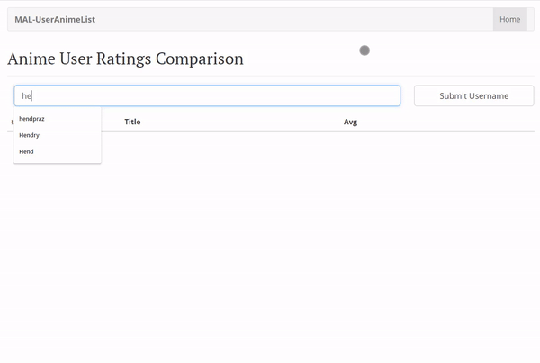

# MyAnimeList User List Client App

## Description

This application made for comparing anime ratings of MyAnimeList user by inputing their usernames. Good to compare your anime ratings with your friends, family, or colleagues. Built with ReactJS.

## How To Run

1. `npm install`
2. `npm start`
3. Input usernames
4. Submit

## Demo

## Features

1. Sort by Anime Title or Sort by Most Watched Animes
2. Average Ratings of Users
3. Shareable link (link changes as user input changes)